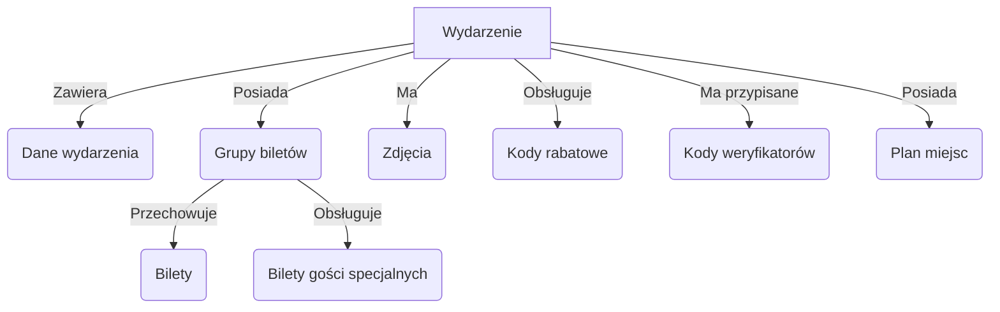

# Moduł Wydarzeń

Dostępne z panelu po linkiem : https://turnup-tickets.pl/admin/index.php?module=events&action=index

## Lista wydarzeń:

Widok wyświetlający listę wszystkich wydarzeń dodanych do systemu, posiada kolumny takie jak:
Lp (liczba porządkowa), miniatura, nazwa, kto jest właścicielem/twórcą wydarzenia, data dodania wydarzenia, status, kolumna z akcjami (akcją edytuj)
Lista jest paginowana, domyślnie po 20 rekordów na stronie (limit jest możliwy do zmiany tylko w plikach konfiguracyjnych).
Funkcjonalności:
Pod belką z informacjami o ogólnymi znajduję się pole wyboru o nazwie Typ widoku (istotne tylko dla dewelopera który tworzy widoki). Funkcja ta ma za zadanie ustawić informację z jakiego pliku widoku korzysta system w tym momencie. Dla listy powinno być wybrane Widok wydarzenia.

- Nad listą znajdują się przyciski Dodaj nowy. Dodaj nowy przenosi na stronę z możliwością utworzenia nowego wydarzenia. 
    
- Wyszukiwarka: Wyszukiwarka filtruje listę wydarzeń i wyszukuje je na podstawie pola podanego w adresie url pod parametrem search_column, domyślnie jest to pole tytul (nazwa wydarzenia).

## Opis
Każde wydarzenie jest tworzone w systemie i posiada następujące informacje:

## Kategorie wydarzeń
Każde wydarzenie ma przypisaną konkretną kategorię główną oraz kategorie do których należy, dzięki którym można przedstawić to wydarznie użytkownikowi pod kilkoma adresami np. Wydarzenia/Grubson lub Pozostałe/Grubson. 
Nazwy kategorii powinny być zależne od języka strony, ale każdy język powinien posiadać taką samą ilość kategorii. 

## Statystyki
Statystyki wydarzenia informują właściciela o danych sprzedażowych w określonych przedziałach czasowych. Dostępne jest także pobranie raportu w formacie PDF.

## Dane wydarzenia
Każde wydarzenie zawiera następujące dane:
- **Podstawowe informacje**:
    - Nazwa wydarzenia
    - Waluta wydarzenia
    - Opis dla wersji językowych
    - Lokalizacja: miasto, ulica, miejsce wydarzenia
    - Mapa automatycznie generowana na podstawie danych lokalizacyjnych
    - Określenie rodzaju wydarzenia (terminowe / bezterminowe)
    - W przypadku wydarzeń terminowych: data rozpoczęcia i zakończenia
    - Strefa czasowa na podstawie lokalizacji
      (Każde pole z treścią powinno być zależne od języka strony, ale każdy język powinien posiadać taką samą ilość wydarzeń.)

- **Statusy wydarzenia**:
    - Status aktywności po zakończeniu
    - Status określający wyświetlanie na stronie głównej
    - Status wysyłki biletu SMS
    - Status wysyłki biletu w formie fizycznej
    - Status biletu jako prezent
    - Status doliczania kosztów dodatkowych

- **Właściciele wydarzenia**:
    - Główny właściciel
    - Dodatkowi właściciele

- **Dodatkowe opcje**:
    - Przypisany plan miejsc (możliwość wyboru miejsc)
    - Kategoria wydarzenia (do rozważenia zamiana na system tagów)
    - Pola na skrypty śledzenia dla:
        - Strony wydarzenia
        - Koszyka
        - Powrotu po płatności
    - Dodatkowe koszty doliczane przy zakupie biletu (możliwość definiowania wielu pozycji)
    - Możliwość ustawienia własnego adresu URL wydarzenia

## Zdjęcia
Zdjęcia przypisane do wydarzenia z możliwością określania ich rozmiarów.

## Grupy biletów
Każde wydarzenie może posiadać przypisane grupy biletów.
- Można je dodać ręcznie lub zaimportować z pliku CSV.
- Można pobrać kontrolną listę biletów (lista kodów oraz osób, które zakupiły bilety).
- Dla każdej grupy biletów można określić:
    - Nazwa
    - Opis
    - Rozliczenie z kontrahentem (procentowe lub kwotowe) - Wartość doliczona do kwoty każdego biletu
    - Dodatkowe opłaty (np. serwisowe) - Wartość doliczona do kwoty każdego biletu
    - Cena jednostkowa biletu
    - Dostępna pula biletów
    - Maksymalna ilość biletów na pojedynczą transakcję
    - Okres sprzedaży (zależny od terminu wydarzenia)
    - Status aktywności grupy
    - Status aktywności po sprzedaży poprzedniej grupy biletów
    - Kolor oznaczenia na planie miejsc

### Zakładka **Bilety**
- Lista wszystkich zakupionych biletów
- Informacja o zeskanowaniu biletu
- Możliwość pobrania biletu

### Zakładka **Bilety gości specjalnych**
- Lista biletów wygenerowanych z pliku CSV
- Takie same dane jak na liście zwykłych biletów

## Kody rabatowe
Zakładka zawierająca kody rabatowe przypisane do konkretnego wydarzenia.
- Dane kodu:
    - Kod rabatowy (ręcznie wpisany lub generowany)
    - Data ważności kodu (od - do)
    - Ilość użyć kodu
    - Wartość obniżki (procentowa lub kwotowa)
    - Status aktywności
    - Przypisanie do konkretnej grupy biletów

## Kody weryfikatorów
Specjalne kody umożliwiające ochronie na wejściu skanowanie i sprawdzanie autentyczności biletów.
- Dane kodu:
    - Kod weryfikatora (manualnie lub generowany)
    - Unikalność kodu w całym systemie
    - Przypisanie kodu do konkretnej grupy biletów

## Plan miejsc
Moduł umożliwiający zarządzanie miejscami przypisanymi do wydarzenia.
- Wyświetlanie schematu miejsc
- Przypisywanie grup biletów do konkretnych miejsc
- Blokowanie wybranych miejsc do sprzedaży

---

## Diagram struktury modułu Wydarzeń

---

## Podsumowanie
Moduł Wydarzeń zarządza pełnym cyklem życia wydarzenia, od jego stworzenia, przez sprzedaż biletów, aż po ich weryfikację przy wejściu. System wspiera także obsługę kodów rabatowych i weryfikatorów oraz pozwala na elastyczne zarządzanie planem miejsc.

Obiekty: 
